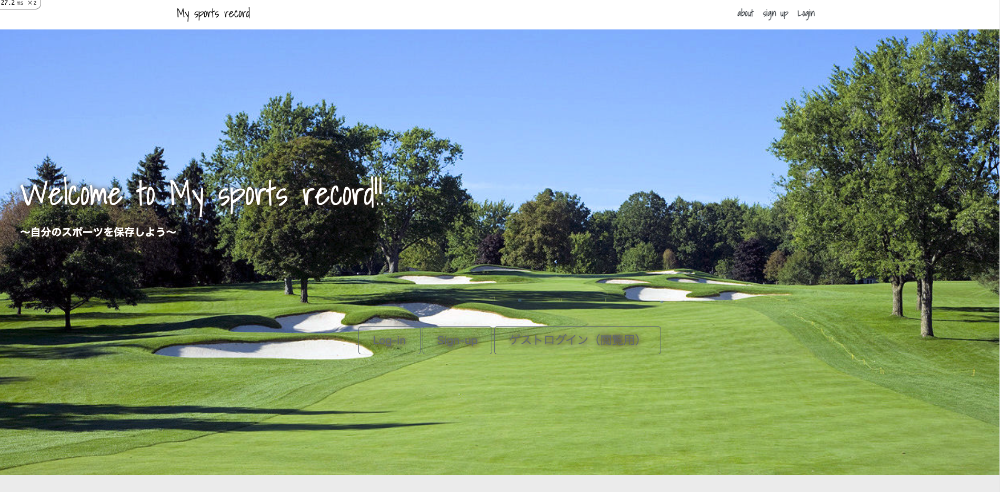

# README

This README would normally document whatever steps are necessary to get the
application up and running.

Things you may want to cover:

* Ruby version

* System dependencies

* Configuration

* Database creation

* Database initialization

* How to run the test suite

* Services (job queues, cache servers, search engines, etc.)

* Deployment instructions

* ...

# My sports record（PF_app）

## サイト概要
### サイトテーマ
スポーツ動画を見て、振り返りやモチベーションup!!

### テーマを選んだ理由
今回私がこのPFのテーマを選んだ理由は、２点あります。
①プログラミング初心者の自分が3ヶ月で学んできたことを最大限活かす
②ラグビーを幼少期からしており、練習動画などを管理、すぐに見返すことのできるよう解決する。

この２つを取り入れることで少しでも、自分なりのPFができると考え作成致しました。
また試合前などにGoodプレーを簡単に視聴し、モチベーションUPに繋げてもらいたいという思いもあります。

### ターゲットユーザ
・スポーツをしている人
・スポーツが好きな人

### 主な利用シーン
・自分の動画を投稿・保存して、振り返りに利用する。
他の人のプレー・Goodぷれーを見てモチベーションUPする。

## 設計書
<>

## 開発環境
- OS：Linux(CentOS)
- 言語：HTML,CSS,JavaScript,Ruby,SQL
- フレームワーク：Ruby on Rails
- JSライブラリ：jQuery
- IDE：Cloud9

## 使用素材
- 外部サービスの画像素材・音声素材を使用した場合は、必ずサービス名とURLを明記してください。
- 使用しない場合は、使用素材の項目をREADMEから削除してください。